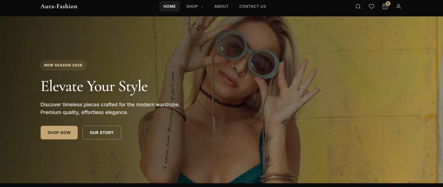
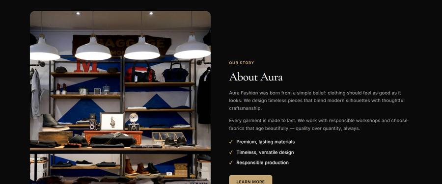
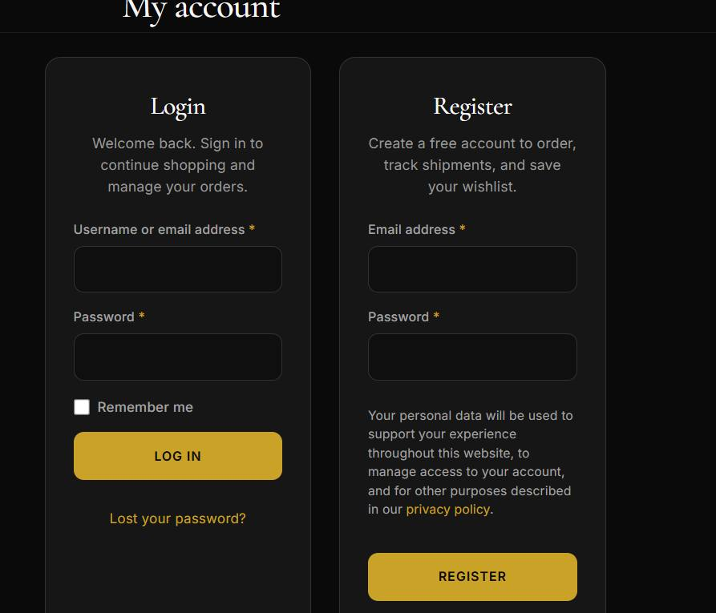
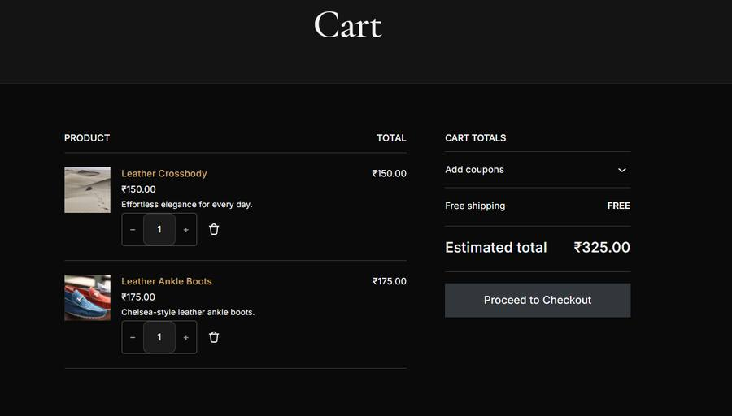

# Aura-Fashion

My first WordPress website, built as a project after finishing a WordPress course. It is a fashion online store made with **WordPress + WooCommerce** and a custom black and soft-gold theme called **Aura Fashion**.

**Live site:** https://aura-fashion.freehosting.dev/
**Guide (what was used, plugins, how to test):** https://github.com/ajay995182/aura-fashion/blob/main/docs/index.html

> This is a **test store**. Every product, price, photo, coupon and order was added only to test the website and its workflow. Payments run in test mode. Nothing is sold or shipped.



## What was used

| Layer | What it is | Who made it |
|---|---|---|
| WordPress + WooCommerce | Base system and shop engine | Ready-made software |
| 7 plugins | Payments, email, speed, security | Ready-made, installed and configured by me |
| Aura Fashion theme | Design and all front-end shopping features | Custom code written with AI help, then installed, tested and corrected by me |

### Plugins (ready-made, not AI-written)

| Plugin | Job |
|---|---|
| WooCommerce | Online store: products, cart, checkout, orders, coupons |
| Payments | Card and local payments (test mode) |
| Jetpack | Security, backups, speed, visitor stats |
| WP Mail SMTP | Reliable delivery of order and password emails |
| WP Mail Logging | Log of every email the site sends |
| W3 Total Cache | Page and browser caching |
| Loginizer Security | Blocks repeated wrong-login attempts |

*Aura Options* (admin settings) and *Lookbooks* (Shop the Look) are features inside my theme, not separate plugins.

## Theme features

Quick View, AJAX add to cart, colour and size swatches, live shop filters, wishlist with sharing, recently viewed, stock and sale countdowns, product video, photo reviews, sticky add to cart, free-shipping progress bar, exit-intent popup, newsletter integration (Mailchimp, Klaviyo, Brevo), order tracking, Buy Again, saved size profile, dark and light mode, mega menu, Lookbook (Shop the Look), Style Journal, SEO schema, lazy loading and a one-click demo import.

Full list: [`theme/aura-fashion/FEATURES.md`](theme/aura-fashion/FEATURES.md)

## Install

Requirements: WordPress 6.0+, PHP 7.4+, WooCommerce.

1. Install WordPress, then install and activate **WooCommerce**.
2. Appearance → Themes → Add New → Upload Theme → `theme/aura-fashion-v1.10.6.zip` → Activate.
3. Settings → Permalinks → Save Changes.
4. Appearance → **Aura Demo Import** → Import Full Demo Content.
5. Open **Aura Options** and Appearance → Customize to set notice, free shipping amount, logo and hero.
6. Install the plugins listed above and configure each one.

## Test it

Open the [guide](https://YOUR-USERNAME.github.io/aura-fashion/) for a 61-point checklist, or read [`theme/aura-fashion/TESTING.md`](theme/aura-fashion/TESTING.md). Test coupons: `AURA10`, `WELCOME15`, `FREESHIP`.

## Screenshots

| | |
|---|---|
|  |  |
|  |  |

## Repository layout

```
aura-fashion/
├── README.md
├── docs/index.html          # the guide page (GitHub Pages)
├── screenshots/             # images used in this README
└── theme/
    ├── aura-fashion/        # theme source code
    └── aura-fashion-v1.10.6.zip   # ready to upload in WordPress
```

## License

The theme is released under the GNU General Public License v2 or later. Plugins keep their own licences.

---
Built by Ajay, student at GITAM University.
